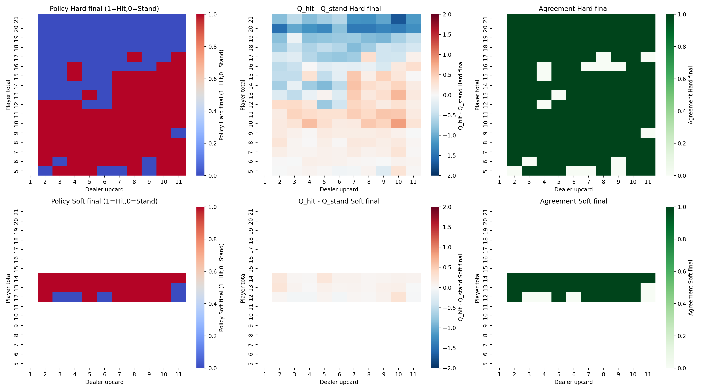
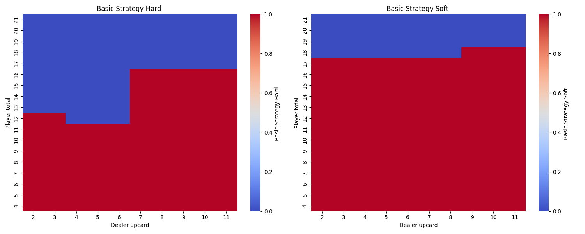
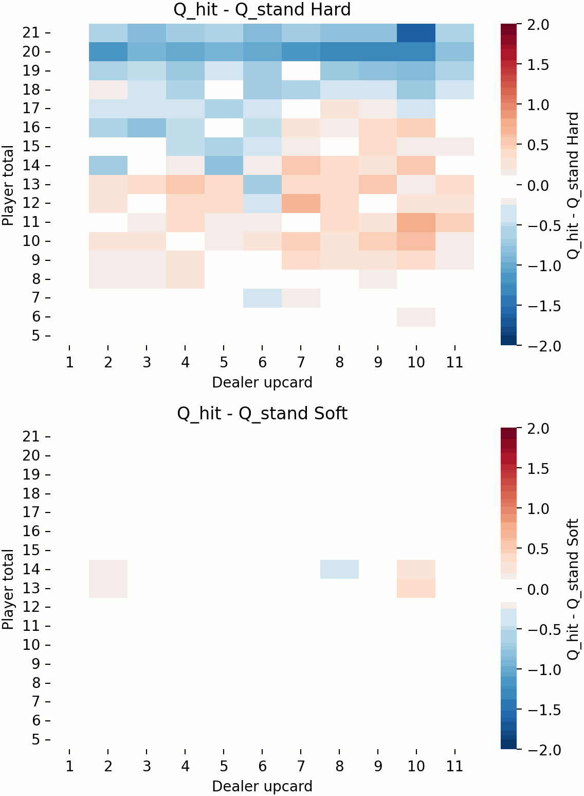
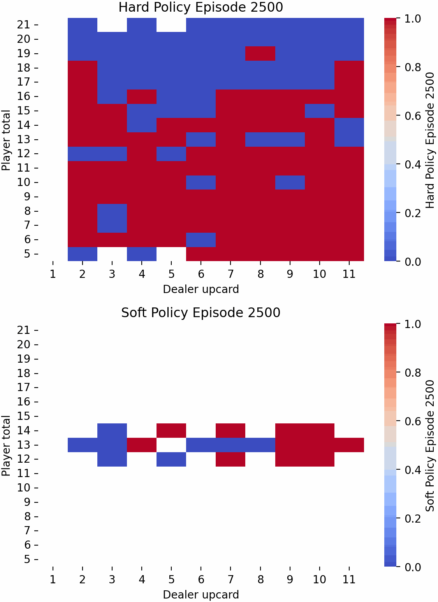
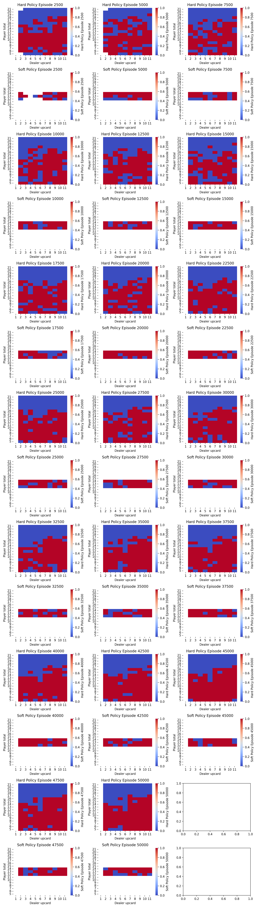
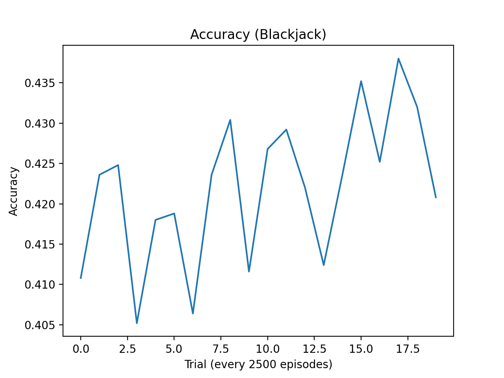

# Blackjack Reinforcement Q-Learning Agent
**BIONB 3500 Final Project**

**Author: Alexa Sheldon**

This project implements a reinforcement learning agent to play Blackjack. Leveraging Q-learning, the agent seeks to understand a possible optimal strategy for playing the game.

## Features
- **Q-Learning Agent**: Trains an agent to play Blackjack using Q-learning.
- **Random Agent**: Contains functionality to compares the Q-learning agent's performance against a random agent.
- **Basic Strategy Comparison**: Contains functionality to compares the Q-learning agent's performance against a basic Blackjack strategy.
- **Visualization**: Generates heatmaps to visualize the learned policy and its agreement with the basic strategy.

Note: since there is randomness to how each game is played (what cards are dealt and epsilon-greedy action selection), each time it is run, it will look slightly different and perform slightly differently. The visualizations shown are the most recent ran and pushed to the Github Repo. 

## Setup Instructions
### 1. Clone the repository
```bash
git clone git@github.com:alexasheldon/blackjack-rl.git
cd blackjack-rl
```
### 2. Create Virtual Environment (for dependencies)
```bash
python -m venv rl-env
```
Activate the venv
- macOS/Linux:
```bash
source rl-env/bin/activate
```
- Windows:
```bash
rl-env\Scripts\activate
```

### 3. Install Dependencies
```bash
pip install -r requirements.txt
```

### 4. Run the Code
You are now free to run `q-agent.py` however you choose to (including in terminal or via play button). 
```bash
python q-agent.py
```

### 5. View Results
This program has logged outputs within the terminal to keep track of progress that you may uncomment if you choose to, and it captures various heatmaps along the way of training. 
- **Basic Strategy Heatmap**: `basic_strategy.png` (for comparison to policy found by Q-agent)
- **Final Policy Heatmaps**: `policy_final.png` (latest policy found by Q-agent)
- **Q-Diffs Evolution Snapshots**: `diff_heatmap_snaps/` (contains Q-diffs for all 20 checkpoints)
- **Policy Evolution Snapshots**: `evolution_snaps/` (contains Q-diffs for all 20 checkpoints)
- **Policy Evolution Snapshots**: `policy_evo_snapshot_19.png` (showing all 20 checkpoints)

If you'd like to convert your snapshots to gifs, you can run `snaps_to_gifs.py` which leverages `Pillow`.
```bash
python snaps_to_gifs.py
```

## Visualizations / Technical Blog
### Final Policy Heatmap
The final policy heatmap shows the agent's learned strategy for both hard and soft hands. The heatmap indicates whether the agent prefers to "hit" or "stand" in different game states. It also shows a comparison between the policy it lands on and the known strategy of Blackjack.



### Basic Strategy Heatmap for Comparison


### Agent's Policy Evolution
The evolution of the policy over training episodes is visualized in a series of snapshots in the below gif and then the grid. These snapshots show how the agent's strategy change over time.

Change in Difference of Q-values over time:


Change in Policy over time:


Final snapshot:


### Accuracy
Evaluating Accuracy (win rate) every 2500 episodes, shows a flucation (likely due to sheer randomness) in the accuracy rate over episodes.


### Blackjack Environment
The `blackjack_environ.py` file defines the Blackjack environment, including the rules of the game, actions, and rewards. As it currently stands, players can only hit and stand, though it has room to expand the state space to include Double/Split/Insurance later on. However, the dealer strategy and the shoe are built to resemble a casino environment.

## Evaluation Metrics
- **Win Rate**: The percentage of games won by the agent.
- **Average Return**: The average reward per hand.
- **Policy Agreement**: The percentage of states where the learned policy matches the basic strategy.

## Acknowledgments
- The Blackjack environment was custom-built for this project.
- The project uses `matplotlib`, `seaborn`, and `Pillow` for data visualization.
- This project was developed with teaching/assistance from Copilot.

---
